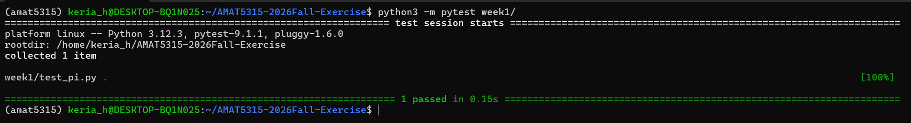

# AMAT5315: Scientific Computing for Physicists - Weekly Exercises

This repository stores my weekly exercises for AMAT5315 (Scientific Computing
for Physicists). Each week lives in its own folder (`week1/`, `week2/`, ...)
containing the task specification in `SPEC.md`, the implementation, and the
tests that verify it. Week 1, for example, contains `pi.py`, a Monte Carlo
estimator of pi, together with `test_pi.py`.

## Install pytest

Install pytest with pip:

```bash
python3 -m pip install pytest
```

## Run the Week 1 tests

From the repository root, run:

```bash
python3 -m pytest week1/
```

This runs `test_pi.py`, which checks that `estimate_pi(1_000_000, seed=2026)`
is within `1e-2` of `math.pi`.

## Week 1 verification


