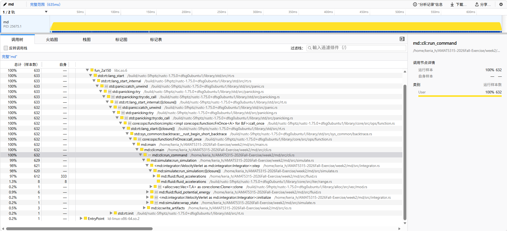
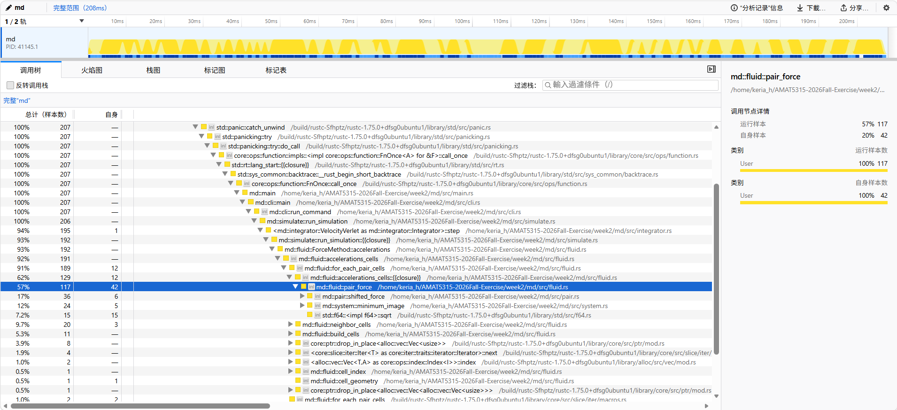
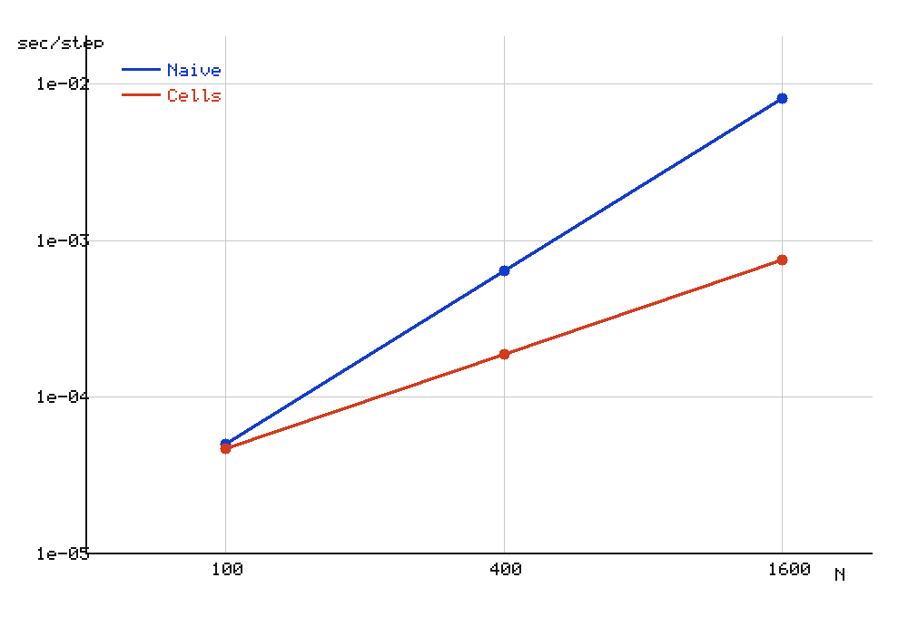

# Week 2 Part 5: Performance measurement

## Timing

Timed on this machine (median and min–max over repeated runs) for the same
default-equivalent workload.

| Program | Median (s) | Range: min–max (s) |
| --- | ---: | ---: |
| NumPy `week2-sim.py` | 7.018 | 6.928–7.090 |
| Rust debug | 3.757 | 3.732–3.787 |
| Rust release | 0.619 | 0.613–0.621 |

Observations (medians):

- Release Rust is about **6.07× faster** than debug Rust (3.757 / 0.619).
- The release median (0.619 s) is below one third of the debug median
  (3.757 / 3 ≈ 1.25 s).
- On this machine release Rust is about **11.34× faster** than the NumPy
  baseline (7.018 / 0.619).

## Profile

| Version | Force share (%) | Elapsed time (s) |
| --- | ---: | ---: |
| Naive | 97.0 | 0.635 |
| Cell list | 92.0 | 0.208 |

Both profiles used the same course-form case:

```
samply record md run --n 400 --eq-steps 200 --steps 1000 --out /tmp/md-prof
```

- The profiled cell-list run is about **3.05× faster** than the naive
  profiled run (0.635 / 0.208).
- Force evaluation remains the dominant workload (cell-list force share
  92%).
- The cell-list elapsed time (0.208 s) is below the naive elapsed time
  (0.635 s).

Hotspot (cell list): `md::fluid::accelerations_cells`




## Benchmark (release, wall-clock; --eq-steps 100 --steps 500 = 600 steps/run)

| N | Naive median (range) | Cells median (range) | Speedup |
| ---: | ---: | ---: | ---: |
| 100 | 0.030 (0.028–0.040) | 0.028 (0.026–0.035) | 1.07 |
| 400 | 0.383 (0.370–0.404) | 0.113 (0.099–0.137) | 3.40 |
| 1600 | 4.823 (4.804–5.006) | 0.449 (0.443–0.472) | 10.75 |

Seconds per integration step (median / 600) are plotted against N on a
log–log scale:



The slopes reflect the pair-search algorithms: naive considers O(N²)
candidate pairs, while at fixed density and cutoff the cell-list candidate
work approaches O(N).

## Pages

The Week 2 molecular-dynamics page is published on GitHub Pages:

https://beryl-h.github.io/AMAT5315-2026Fall-Exercise/

The page loads `docs/traj.jsonl` (with `docs/run.json` beside it) and shows
four views of the N = 400 heating trajectory: particles colored by speed,
the speed histogram against the 2-D Maxwell–Boltzmann distribution, the
pair structure g(r), and temperature / relative energy through time.

The crate API documentation (generated with `cargo doc --no-deps`) is
published at:

https://beryl-h.github.io/AMAT5315-2026Fall-Exercise/md/

## Heating trajectory (Part 5)

From the repository root, the official course heating run:

```bash
md run --n 400 --temperature 0.2 --ramp-to 1.2 \
  --steps 20000 --sample-every 100 --out docs
```

This writes `docs/run.json` and `docs/traj.jsonl`: N = 400, 200 saved
frames (20000 / 100), and a 0.2 → 1.2 temperature ramp (`"ramp_to": 1.2`
is recorded in `docs/run.json`). This is the trajectory shown on the
Pages site.

## Cold / hot videos

The required structural-order comparison: a cold solid (T = 0.2) and a hot
liquid (T = 1.0), both N = 100 with the default 10000 production steps
saved every 50 (200 frames each):

```bash
# cold solid
md run --n 100 --temperature 0.2 --dt 0.01 --eq-steps 2000 \
  --steps 10000 --sample-every 50 --seed 2026 --out /tmp/cold
md video /tmp/cold --out week2/cold.mp4

# hot liquid
md run --n 100 --temperature 1.0 --dt 0.01 --eq-steps 2000 \
  --steps 10000 --sample-every 50 --seed 2026 --out /tmp/hot
md video /tmp/hot --out week2/hot.mp4
```

Both MP4s are under the course's 2 MB limit (cold ≈ 232 KB, hot ≈ 410 KB).

## Reproducing the tables and figures

- Timing table (Part 5): the Rust debug/release and NumPy medians. Rust
  timings are reproducible by timing the same default-equivalent workload
  with `cargo run` (debug) and `cargo run --release`.
  [Need confirmation]: the NumPy baseline script `week2-sim.py` referenced
  in the table is not committed to the repository.
- Profile table and flamegraphs (Part 5): profiled with
  `samply record md run --n 400 --eq-steps 200 --steps 1000 --out /tmp/md-prof`.
  [Need confirmation]: the flamegraph screenshots `profile-naive.png` /
  `profile-cells.png` are saved manually from the samply UI.
- Benchmark table and `scaling.png` (Part 5): measured with
  `md run --eq-steps 100 --steps 500` (600 steps/run) for N = 100, 400, 1600.
  [Need confirmation]: the plotting script that draws `scaling.png` is not
  committed.
- `field.png` (Part 2, LJ pair field), from the repository root:
  ```bash
  MPLCONFIGDIR=/tmp/matplotlib python3 week2/plot_lj_field.py
  ```
  [Need confirmation]: requires a Python environment with numpy +
  matplotlib, which is not part of the committed repository.
- `dimer.png` (Part 3, dimer energy error), from the repository root:
  ```bash
  MPLCONFIGDIR=/tmp/matplotlib python3 week2/plot_dimer.py
  ```
  [Need confirmation]: requires numpy + matplotlib; the original run used
  a venv at `/tmp/ljplotenv` which is not committed.
- `fluid.mp4` (Part 4, default contract video), from `week2/`:
  ```bash
  make reproduce
  cargo run --manifest-path md/Cargo.toml --release -- video artifacts --out week2/fluid.mp4
  ```

## Verification evidence (measured on this machine)

- Release suite: `cargo test --manifest-path md/Cargo.toml --release`
  passes, including the naive/cells force-equality tests (`tests/cells.rs`)
  and the heating schedule tests (`tests/heating.rs`).
- Unheated contract (from `week2/`):
  ```bash
  make reproduce
  cargo run --manifest-path md/Cargo.toml --release -- check artifacts
  ```
  - max energy mismatch = 8.467e-16
  - secular drift = 1.477132e-4, PASS against 2e-3
  - T_speed = 0.462423, PASS against target 0.50 ± 0.05
  - chi2_22 = 0.8285, PASS against 2
- Release Rust is faster than the naive/debug build on this machine per the
  Timing table (release median 0.619 s vs debug 3.757 s vs NumPy 7.018 s).
- The cell-list speedup grows with N per the Benchmark table (1.07× at
  N = 100, 3.40× at 400, 10.75× at 1600).
- cold.mp4 (solid, T = 0.2) vs hot.mp4 (liquid, T = 1.0) is the required
  structural-order comparison; the heating page uses N = 400 and 200 frames
  with a 0.2 → 1.2 ramp.

VERIFY (pending, user): whether the cold solid actually shows crystalline
order and the hot liquid shows melting (for example the g(r) long-range
peaks shrinking) has not yet been visually confirmed by the user in the page
or videos. Open the Pages URL in a private/incognito window to confirm.
